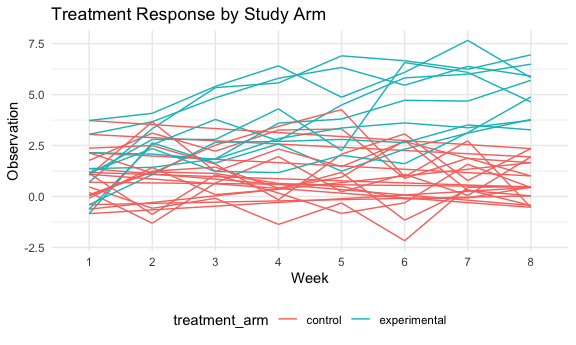
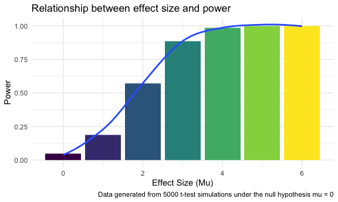
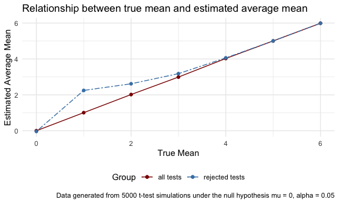

Homework 5: Iteration
================
Cynthia Liu (cl3938)
11/18/2020

## Problem 1

Read in & clean the data.

``` r
homicide_df = 
  read_csv("./data/homicide-data.csv") %>% 
  mutate(
    city_state = str_c(city, state, sep = "_"),
    resolved = case_when(
      disposition == "Closed without arrest" ~ "unsolved",
      disposition == "Open/No arrest"        ~ "unsolved",
      disposition == "Closed by arrest"      ~ "solved",
    )
  ) %>% 
  select(city_state, resolved) %>%
  filter(city_state != "Tulsa_AL")
```

    ## Parsed with column specification:
    ## cols(
    ##   uid = col_character(),
    ##   reported_date = col_double(),
    ##   victim_last = col_character(),
    ##   victim_first = col_character(),
    ##   victim_race = col_character(),
    ##   victim_age = col_character(),
    ##   victim_sex = col_character(),
    ##   city = col_character(),
    ##   state = col_character(),
    ##   lat = col_double(),
    ##   lon = col_double(),
    ##   disposition = col_character()
    ## )

Let’s look at this a bit

``` r
aggregate_df = 
  homicide_df %>% 
  group_by(city_state) %>% 
  summarize(
    hom_total = n(),
    hom_unsolved = sum(resolved == "unsolved")
  )
```

    ## `summarise()` ungrouping output (override with `.groups` argument)

Can I do a prop test for a single city?

``` r
prop.test(
  aggregate_df %>% filter(city_state == "Baltimore_MD") %>% pull(hom_unsolved), 
  aggregate_df %>% filter(city_state == "Baltimore_MD") %>% pull(hom_total)) %>% 
  broom::tidy()
```

    ## # A tibble: 1 x 8
    ##   estimate statistic  p.value parameter conf.low conf.high method    alternative
    ##      <dbl>     <dbl>    <dbl>     <int>    <dbl>     <dbl> <chr>     <chr>      
    ## 1    0.646      239. 6.46e-54         1    0.628     0.663 1-sample… two.sided

Try to iterate ……..

``` r
results_df = 
  aggregate_df %>% 
  mutate(
    prop_tests = map2(.x = hom_unsolved, .y = hom_total, ~prop.test(x = .x, n = .y)),
    tidy_tests = map(.x = prop_tests, ~broom::tidy(.x))
  ) %>% 
  select(-prop_tests) %>% 
  unnest(tidy_tests) %>% 
  select(city_state, estimate, conf.low, conf.high)
```

``` r
results_df %>% 
  mutate(city_state = fct_reorder(city_state, estimate)) %>% 
  ggplot(aes(x = city_state, y = estimate)) +
  geom_point() + 
  geom_errorbar(aes(ymin = conf.low, ymax = conf.high)) + 
  theme(axis.text.x = element_text(angle = 90, vjust = 0.5, hjust = 1))
```


``` r
homicide_df = 
  read_csv("data/homicide-data.csv") %>% 
  mutate(
    city_state = str_c(city, state, sep = "_"),
    resolved = case_when(
      disposition == "Closed without arrest" ~ "unsolved",
      disposition == "Open/No arrest"        ~ "unsolved",
      disposition == "Closed by arrest"      ~ "solved",
    )
  ) %>% 
  select(city_state, resolved) %>% 
  filter(city_state != "Tulsa_AL") %>% 
  nest(data = resolved)
```

    ## Parsed with column specification:
    ## cols(
    ##   uid = col_character(),
    ##   reported_date = col_double(),
    ##   victim_last = col_character(),
    ##   victim_first = col_character(),
    ##   victim_race = col_character(),
    ##   victim_age = col_character(),
    ##   victim_sex = col_character(),
    ##   city = col_character(),
    ##   state = col_character(),
    ##   lat = col_double(),
    ##   lon = col_double(),
    ##   disposition = col_character()
    ## )

## Problem 2

**Read in files and create raw dataframe:**

``` r
loc = "./data/trial-data/"
path_df = 
  tibble(
    path = list.files(loc),
  ) %>%
  mutate(
    path = str_c("./data/trial-data/", path),
    data = map(.x = path, ~read_csv(.x))
  ) %>%
  unnest(data)
```

**Clean raw dataset:**

``` r
trial_df = path_df %>%
  mutate(path = map(.x = path, ~str_extract(.x, "(?<=./data/trial-data/).*(?=.csv)"))) %>%
  separate(path, c("treatment_arm", "patient_id"), sep = "_") %>%
  mutate(treatment_arm = ifelse(treatment_arm == "con", "control", "experimental")) %>%
  pivot_longer(
    cols = starts_with("week"),
    names_to = "week",
    names_prefix = "week_",
    values_to = "observation"
  ) 
```

**Spaghetti plot of subject observations over time, grouped by study
treatment arm:**

``` r
trial_df %>% 
  ggplot(aes(x = week, y = observation)) +
  geom_path(aes(group = patient_id, color = treatment_arm)) +
  labs(
    title = "Treatment Response by Study Arm",
    x = "Week",
    y = "Observation"
  ) + scale_color_lancet()
```



The plot shows clear differences between the control and experimental
group over time. At study onset, both groups are indistinguishable in
terms of measurements. However, as time progresses, observations of the
experimental group become, on average, higher than those for the control
group. At week 8, the two groups are completely separate. For the
control group, measurement variation within the group seems to decrease
over time, with the possibility of decreasing average measurement. This
seems to suggest that the experimental treatment is effective, though
it’s unclear what it does and whether or not it’s the intended
purpose.

## Problem 3

Let’s explore power in a two-sided one-sample t-test:

**Generating simulation data:**

``` r
#fixed parameters
sample_size = 30
sigma = 5
mu_min = 0
mu_max = 6

#function to simulate single t-test
sim_t_test = function(mu) {
  
  sim_data = tibble(
    x = rnorm(n = sample_size, mean = mu, sd = sigma),
  )
  
  output = t.test(sim_data, mu = 0, conf.level = 0.95) %>%
  broom::tidy() %>%
  select(estimate, p.value)
}

#function to simulate multiple t-tests and calculate desired values
multiple_sim_prop = function(mu) {
  
  results =
    rerun(5000, sim_t_test(mu)) %>% 
    bind_rows() %>%
    summarize(
      mean_mu = mean(estimate),
      mean_rej_mu = mean(estimate[p.value <= 0.05]),
      count_rej = sum(p.value <= 0.05),
      prop_rej = count_rej/ n()
    )
  results
}

#run simulation for means from 0-6
test_output = 
  tibble(mu = 0:6) %>%
  mutate(values = map(.x = mu, ~multiple_sim_prop(.x))) %>%
  unnest(values)
```

**Plot showing relationship between effect size and power:**

``` r
test_output %>%
  ggplot(aes(x = mu, y = prop_rej, fill = mu)) +
  geom_bar(stat = 'identity') +
  geom_smooth(se = F) +
  labs(
    title = "Relationship between effect size and power",
    x = "Effect Size (Mu)",
    y = "Power",
    caption = "Data generated from 5000 t-test simulations under the null hypothesis mu = 0") + 
  theme(legend.position = "none")
```

    ## `geom_smooth()` using method = 'loess' and formula 'y ~ x'



The plot shows that as effect size increases, so does power. The
relationship is almost exponential, but difficult to tell as the it
flattens as power approaches 1. At an effect size of 4 or greater, power
is roughly 1.

**Two-panel plot showing relationship between true and estimated mu**

``` r
test_output %>%
  ggplot(aes(x = mu)) +
  geom_line(aes(y = mean_mu, color = "all")) +
  geom_line(aes(y = mean_rej_mu, color="reject"), linetype="twodash") +
  geom_point(aes(y = mean_mu, color = "all")) +
  geom_point(aes(y = mean_rej_mu, color="reject")) +
  labs(
    title = "Relationship between true mean and estimated average mean",
    x = "True Mean",
    y = "Estimated Average Mean",
    caption = "Data generated from 5000 t-test simulations under the null hypothesis mu = 0, alpha = 0.05") +
  scale_color_manual(
    name = "Group",
    values = c("all"= "darkred", "reject" = "steelblue"),
    labels = c("all tests", "rejected tests"))
```



The plot shows that for all values of the true mean, the estimated
average mean across all simulations approximates the true mean. However,
the estimated average mean of the tests where the null was rejected does
not always approximate the true mean; it is better at estimating the
true mean of the distribution as power increases (see above for power
image). This is likely because at lower power, estimated means need to
be much more extreme to lead to a rejection.

The exception to this is when the true mean = 0, the estimated average
mean appears to approximate the true mean. However, this is because the
because the extreme values cancel each other out; because true mean = 0,
the extreme estimated means that lead to rejection are equally as likely
to be negative as positive, so the average of those extreme estimated
means is close to 0. As the true mean increases, the extreme values are
more likely to be positive as negative, leading to overestimates in the
estimated average mean.
